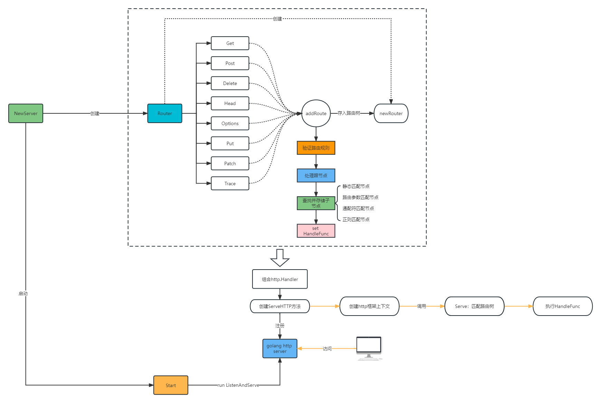
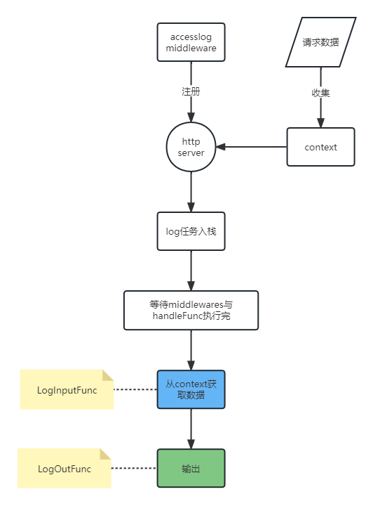

# beweb

<br>

## 1 web框架主体与router


<br>

## 2 middleware设计

<br>

### 2.1 AOP
横向关注点：与业务不那么密切，但又需要处理的  
常见有：  
- 可观测性：logging、metric和tracing
- 安全相关：登录、鉴权与权限控制
- 错误处理：e.g.错误页面支持
- 可用性保证：熔断、限流和降级等

<br>

### 2.2 access log
请求日志，支持自定义输入和输出  
通过链式调用，暴露`LogOutFunc`和`LogInputFunc`接口方便用户扩展输入输出


<br>

### 2.3 Trace，OpenTelemetry
tracing：开源工具有SkyWalking、Zipkin、Jeager等   
为摆脱第三方依赖，可以提供API做自定义扩展：    
- Log API  
- Config API  
- Tracing API  
- Metrics API  
  
缺点：  
- 过度设计：有些原API只有一种默认实现，而且不愿意为框架接口提供扩展实现  
- API设计局限性：问题在于易用性、扩展性等主观性太强  

对以上考虑，`beweb`依赖`OpenTelemetry API`作为抽象层  
OpenTelemetry是OpenTracing和OpenCensus合并而来，属于新时代的可观测平台  
- 同时支持logging、tracing、metrics  
- 提供了各种语言的SDK  
- 适配了各种开源框架，如：Zipkin、Jeager、Prometheus  

OpenTelemetry使用  
TraceProvider：用于构造tracer实例   
tracer：追踪者，需要一个instrumentationName，一般来说就是指构造tracer的地方的包名（保证唯一性）  
span：用于调用tracer上的start方法，如果传入的context已经有一个span，那么新创建的span就是span的子span。span结尾必须调用end   

<br>

### 2.4 Prometheus
已支持，参考demo即可

<br>

### 2.5 error page
支持定义不同状态码响应不同数据

<br>

### 2.6 panic recover
支持发生panic后，输出recover的error信息、context信息、stack堆栈信息

<br>

## 3 other part

<br>

### 3.1 页面模板引擎

<br>

### 3.2 文件处理

<br>

### 3.3 Session

<br>

## 4 使用

<br>

### 4.1 创建服务
```go
//创建服务
s := beweb.NewHTTPServer()
//运行
s.Start(":8080")
```

<br>

### 4.2 创建路由
path 限制：
- 不支持空字符串
- 必须以 / 开头
- 不能以 / 结尾
- 中间不能有连续的 ///

优先级：  
- 【静态路由】  route: /test/123                => http://127.0.0.1:8080/test/123  
- 【参数路由】  route: /test/:id                => http://127.0.0.1:8080/test/1  
- 【通配符路由】 route: /test/*\/user            => http://127.0.0.1:8080/test/abc/user  
- 【正则路由】  route: /test/Reg(^\d{4}-\d{8}$) => http://127.0.0.1:8080/test/0931-87562388   

互相不能共存，会导致painc，只能和【静态路由】共存 
例如：  
```go
s.Get("/user/:id", func(ctx *beweb.Context) {
    fmt.Println("hello user")
})
s.Get("/user/*/abc", func(ctx *beweb.Context) {
    fmt.Println("hello user")
})
```
> panic: method: GET, path: /user/*/abc, error: 不允许同时存在【参数路由】和【通配符路由】，已存在【参数路由】

```go
//创建静态路由
s.Get("/user", func(ctx *beweb.Context) {
    fmt.Println("hello world")
})

//创建路由参数路由
s.Get("/user/:id", func(ctx *beweb.Context) {
    fmt.Println("hello user")
})

//创建通配符路由
s.Get("/order/*/detail", func(ctx *beweb.Context) {
    fmt.Println("hello order")
})

//创建正则路由
s.Get("/info/Reg(^\\d{4}-\\d{8}$)", func(ctx *beweb.Context) {
    fmt.Println("hello info")
})
```

<br>

### 4.3 获取参数
```go
s.Get("/param/:name", func(ctx *beweb.Context) {
    //获取路由参数
    value, err := ctx.PathValue("name")
    fmt.Println(value, err)
    value, err = ctx.PathParam("name").String()
    fmt.Println(value, err)
    
    //获取所有路由参数
    all := ctx.PathValueAll() //map[string]string
    fmt.Println(all)
    all = ctx.PathParams //map[string]string
    fmt.Println(all)
    
    //获取get参数
    value, err = ctx.QueryValue("id")
    fmt.Println(value, err)
    id, err := ctx.QueryParam("id").Int64()
    fmt.Println(id, err)
    
    //获取所有get参数
    all = ctx.QueryValueAll() //map[string]string
    fmt.Println(all)
    all = ctx.QueryParams //map[string]string
    fmt.Println(all)
    
    //获取Form参数
    value, err = ctx.FormValue("date")
    fmt.Println(value, err)
    value, err = ctx.FormParam("date").String()
    fmt.Println(value, err)
    
    //获取所有Form参数
    all, err = ctx.FormValueAll() //map[string]string
    fmt.Println(all, err)
    all = ctx.FormParams //map[string]string
    fmt.Println(all)
    
    //获取json参数
    type user struct {
        id   int    `json:"id"`
        name string `json:"name"`
    }
    var u user
    err = ctx.BindJSON(&u)
    fmt.Println(u, err)
})
```

<br>

### 4.4 响应数据
```go
//返回字符串
s.Get("/response", func(ctx *beweb.Context) {
    ctx.Response(200, []byte("success"))
})

//使用扩展包 import "github.com/BreezeHubs/beweb/util"
//json
s.Get("/response/json", func(ctx *beweb.Context) {
    type xml struct {
        Id   int    `xml:"id"`
        Name string `xml:"name"`
    }
    util.ResponseJSON(ctx, 200, "SUCCESS", "请求成功", &xml{
        Id:   1,
        Name: "haha",
    })
})

//xml
s.Get("/response/xml", func(ctx *beweb.Context) {
    type xml struct {
        Id   int    `xml:"id"`
        Name string `xml:"name"`
    }
    util.ResponseXML(ctx, 200, &xml{
        Id:   1,
        Name: "haha",
    })
})
```

<br>

### 4.5 cookie
```go
s.Get("/cookie", func(ctx *beweb.Context) {
    ck := &http.Cookie{
        Name:    "test",
        Value:   "test",
        Expires: time.Now().Add(1 * time.Hour),
    }
    ctx.SetCookie(ck)
})
```

<br>

### 4.6 服务配置
http退出超时设置
```go
s := beweb.NewHTTPServer(
    beweb.WithShutdownTimeout(10*time.Second),
)
```

优雅退出设置
WithGracefullyExit(是否开启，回收操作，回收超时)
```go
//创建服务
s := beweb.NewHTTPServer(
    beweb.WithGracefullyExit(true, func() {
        fmt.Println("test：进行一些回收动作...")
        time.Sleep(2 * time.Second)
        fmt.Println("test：回收完成")
    }, 10*time.Second),
)
```
run后使用一次Ctrl+c触发退出，两次则强制退出  
> E:\beweb\cmd> go run .  
test：进行一些回收动作...  
test：回收完成  
exit  

<br>

定义输入输出的access log
```go
mdl := NewMiddlewareBuilder().
    LogInputFunc(func(ctx *beweb.Context) (string, error) {
        l := struct {
            ServerName string `json:"server_name"`
            Host       string `json:"host"`
            Route      string `json:"route"` //完整的命中的路由
            HTTPMethod string `json:"http_method"`
            Path       string `json:"path"`
        }{
            ServerName: "test-server",
            Host:       ctx.Req.Host,
            Route:      ctx.MatchedRoute, //完整的命中的路由
            HTTPMethod: ctx.Req.Method,
            Path:       ctx.Req.URL.Path,
        }
        data, err := json.Marshal(l)
        return string(data), err
    }).
    LogOutFunc(func(logString string, err error) {
        fmt.Println(logString)
    }).Build()

s := beweb.NewHTTPServer(
    beweb.WithMiddlewares(mdl),
)
```

链路追踪
```go
tracer := otel.GetTracerProvider().Tracer(instrumentationName)
builder := NewMiddlewareBuilder().SetTrace(tracer).Build()

s := beweb.NewHTTPServer(
    beweb.WithMiddlewares(builder),
)

s.Get("/user", func(ctx *beweb.Context) {
    c, span := tracer.Start(ctx.Req.Context(), "first_layer")
    defer span.End()

    secondC, second := tracer.Start(c, "second_layer")
    time.Sleep(time.Second)

    _, third1 := tracer.Start(secondC, "third_layer_1")
    time.Sleep(100 * time.Millisecond)
    third1.End()

    _, third2 := tracer.Start(secondC, "third_layer_2")
    time.Sleep(300 * time.Millisecond)
    third2.End()

    second.End()

    _, first := tracer.Start(ctx.Req.Context(), "first_layer_1")
    defer first.End()

    time.Sleep(100 * time.Millisecond)

    util.ResponseJSONSuccess(ctx, struct {
        Id   int    `json:"id"`
        Name string `json:"name"`
    }{
        Id:   1,
        Name: "breeze",
    })
})

initZipkin() //or initJeager()
//访问：http://localhost:9411/zipkin/

s.Start(":8080")
```
initZipkin()
```go
func initZipkin() {
	url := "http://localhost:9411/api/v2/spans"
	serviceName := "opentelemetry-demo"

	exporter, err := zipkin.New(
		url,
		zipkin.WithLogger(
			log.New(os.Stderr, serviceName, log.Ldate|log.Ltime|log.Llongfile),
		),
	)
	if err != nil {
		panic(err)
	}

	tp := sdktrace.NewTracerProvider(
		sdktrace.WithSpanProcessor(
			sdktrace.NewBatchSpanProcessor(exporter),
		),
		sdktrace.WithResource(resource.NewWithAttributes(
			semconv.SchemaURL,
			semconv.ServiceNameKey.String(serviceName),
			attribute.String("environment", "dev"),
			attribute.Int64("ID", 1),
		)),
	)
	otel.SetTracerProvider(tp)
}
```
initJeager()
```go
func initJeager() {
	url := "http://localhost:14268/api/traces"
	serviceName := "opentelemetry-demo"

	exp, err := jaeger.New(
		jaeger.WithCollectorEndpoint(
			jaeger.WithEndpoint(url),
		),
	)
	if err != nil {
		panic(err)
	}

	tp := sdktrace.NewTracerProvider(
		// Always be sure to batch in production.
		sdktrace.WithBatcher(exp),
		// Record information about this application in a Resource.
		sdktrace.WithResource(resource.NewWithAttributes(
			semconv.SchemaURL,
			semconv.ServiceNameKey.String(serviceName),
			attribute.String("environment", "dev"),
			attribute.Int64("ID", 1),
		)),
	)
	otel.SetTracerProvider(tp)
}
```

<br>

prometheus
```go
builder := NewMiddlewareBuilder(
    "breeze",
    "web",
    "http_response",
    nil,
).Build()

s := beweb.NewHTTPServer(
    beweb.WithMiddlewares(builder),
)

s.Get("/user", func(ctx *beweb.Context) {
    //暂停随机时间，查看监控
    val := rand.Intn(1000) + 1
    time.Sleep(time.Duration(val) * time.Millisecond)

    util.ResponseJSONSuccess(ctx, struct {
        Id   int    `json:"id"`
        Name string `json:"name"`
    }{
        Id:   1,
        Name: "breeze",
    })
})

//prometheus http
go func() {
    http.Handle("/metrics", promhttp.Handler())
    http.ListenAndServe(":8082", nil)
}()

s.Start(":8080")
```

error page
```go
builder := NewMiddlewareBuilder()
builder.
	AddResponseContent(http.StatusNotFound, []byte("404 NOT FOUND")).
    AddResponseContent(http.StatusBadRequest, []byte("400 BAD REQUEST")).
	Build()

s := beweb.NewHTTPServer(beweb.WithMiddlewares(builder))
s.Start(":8080")
```

panic recover
```go
builder := NewMiddlewareBuilder().
    SetPanicResponse(510, []byte("SERVER PANIC")). //设置panic后响应的response
	//输出context数据
    SetLogWithContext(func(ctx *beweb.Context) {
        fmt.Println("LogWithContext: ", string(ctx.ResponseContent))
    }).
    //输出panic recover的error数据
    SetLogWithErr(func(err any) {
        fmt.Println("LogWithErr: ", err.(string))
    }).
	//可覆盖设置，且会更新输出顺序
    SetLogWithContext(func(ctx *beweb.Context) {
        fmt.Println("LogWithContext1: ", string(ctx.ResponseContent))
    }).
	//输出错误堆栈信息
    SetLogWithStack(func(stack string) {
    	fmt.Println("LogWithStack: ", stack)
    }).
    Build()

s := beweb.NewHTTPServer(beweb.WithMiddlewares(builder))
s.Get("/panic", func(ctx *beweb.Context) {
    value, _ := ctx.QueryValue("dev")
    if value == "1" {
        panic("panic aaaaaa")
    }
})

s.Start(":8080")
//curl http://127.0.0.1:8080/panic?dev=1
```